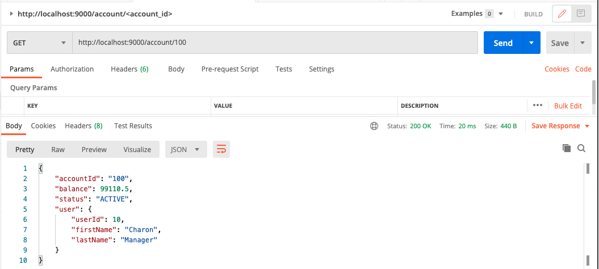
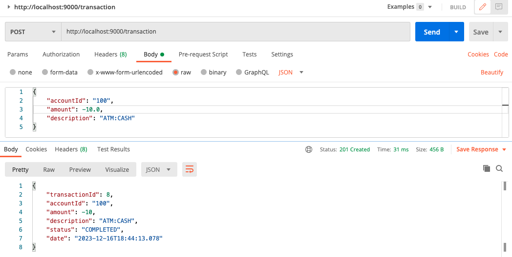
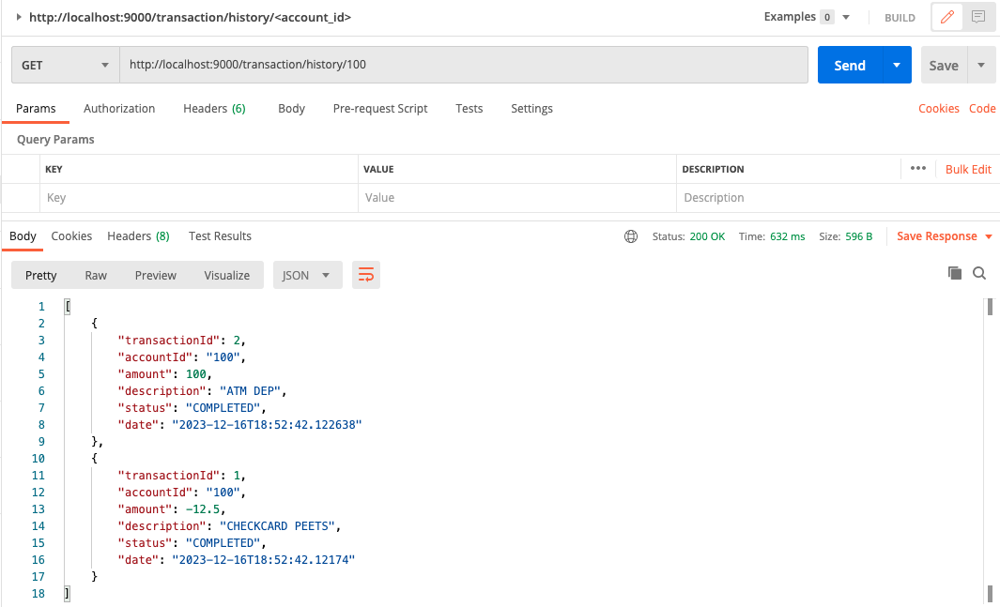
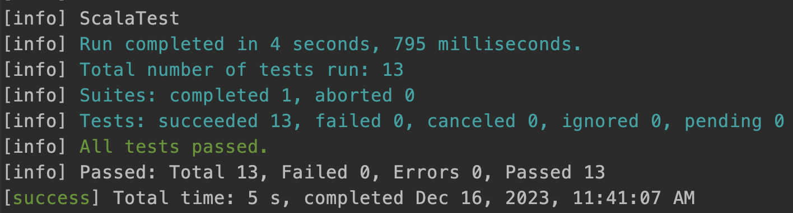

# A simple bank account management application

## Running the app

Run the following commands from the project's folder bank-scala, to prepare and run in a Docker container
```bash
sbt clean reload compile
sbt docker:stage
sbt docker:publishLocal
docker run --rm -p9000:9000 directbooks-coding-exercise:1.0-SNAPSHOT
```
Alternatively, run this project from the source, using [sbt](http://www.scala-sbt.org/).

```bash
sbt run
```

## Routes and parameters

- `/account/{account_id}`: GET endpoint to retrieve the balance and user details of a bank account


- `/transaction/`: POST endpoint to create a new transaction for a bank account


- `/transaction/history/{account_id}`: GET endpoint to retrieve the history of transactions for a bank account


## Test results

